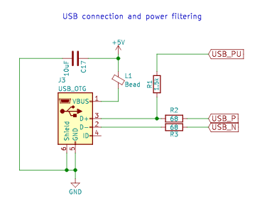
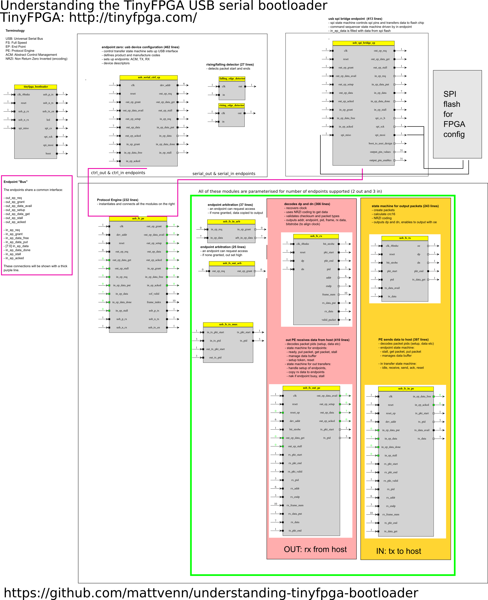

# Understanding the TinyFPGA bootloader.

This bootloader was written by Luke Valenty. The TinyFPGA website is
http://tinyfpga.com/

I am learning verilog with the new open source Icestorm tools from Clifford Wolf.
http://www.clifford.at/icestorm/

I was very interested in the bootloader and it seemed a good way to further my
understanding of Verilog, FPGAs and USB to study it. 

Thanks to Luke for publishing his work and Clifford for the tools for us to
learn and use this amazing hardware.

The bootloader repo is here https://github.com/tinyfpga/TinyFPGA-Bootloader

# Aim

The aim of the bootloader is to allow easy and cheap transmission of FPGA configuration files
over USB to get stored in FPGA connected SPI FLASH memory. Data is sent over an
emulated serial port. 

On other boards a moderately expensive serial to usb chip
(like the FTDI ones) is used. One exception is the BlackIce board that uses an
ARM chip to provide USB comms. The FPGA configuration is stored on the ARM
chip's EEPROM.

# USB Overview

USB is host centric, all setup and data transfers are initiated by the host.

Data is transferred serially (the S in USB), on a differential pair: D+ and D-.

When a new device is plugged in, the host detects this by monitoring the D+ and
D- lines. The host will then configure the device.

USB supports 4 transfer/endpoint types: control, interrupt, isochronous and bulk
transfers. Control transfers are used for device setup on endpoint zero. 

Endpoints exist only on the device, and are data sources or sinks.

# Limitations of the bootloader

USB is a complex, multi layered protocol, and implementing it all on a small FPGA would be
difficult. However, by limiting the requirements to the application it becomes more approachable.

* full speed (12MHz), High speed requires current drivers.
* limited number of endpoints - configured with NUM_OUT_EPS and NUM_IN_EPS
* 3 types of endpoint - endpoint 0, CDC ACM and serial.
* only support 2 of the 4 types of transfer: interrupt (control) and bulk (serial)
* after initial configuration, don't support CDC ACM endpoint
* limited data packet size: set to 32 bytes - MAX_IN_PACKET_SIZE parameter

## Electrical

USB devices indicate their speed to the host by pulling either D+ or D- up to
3.3v. Full speed devices like the TinyFPGABootloader need to pull up D+ to
3.3v, low speed devices pull D- to 3.3v.

In this case, the pull up is enabled by the bootloader and is never turned off.

## How it works

The top module is bootloader.v. It sets up a 48MHz clock with the PLL, the warm boot
functionality of the ICE40 and instantiates the tinyfpga_bootloader module: tinyfpga_bootloader.v.

USB rx and tx pins are inout types, and data direction is handled by a usb_tx_en
pin controlled by the USB protocol engine.

The tinyfpga_bootloader module controls the LED and sets up the USB protocol
engine. It instantiates:

* endpoint 0
* the SPI bridge
* the USB protocol engine - connected to the above endpoints

The endpoints (and addresses) are:

out: serial (1), control (0)
in: CDC ACM (2), serial (1), control (0)

The CDC ACM endpoint is a fake one, set to deliver 0s to the host.

The USB protocol engine is defined in usb_fs_pe.v. It handles the low level USB
data and after data recovery and decoding sends and receives data to the endpoint interfaces.

It uses a number of modules to:

* decode and encode the data onto the wires (NRZI), checksums, data direction: usb_fs_rx/tx.v
* data transfer from/to endpoints: usb_fs_out/in_pe.v
* endpoint arbitration: usb_fs_in/out_arb.v

USB is configured by the host communicating with endpoint id 0. Endpoint 0
functionality is handled by the state machine and ROM in usb_serial_ctrl_ep.v.
It sets up the USB device as an emulated serial port with 3 endpoints:

* ACM in (would be used for configuring serial port)
* serial in
* serial out

The SPI memory controller is defined in usb_spi_bridge_ep.v. It is connected to
the serial in and out endpoints for reading and writing the FLASH. It uses 2
state machines.

The SPI state machine manages reading and writing to FLASH.

The command sequencer state machine receives commands and data from the
serial_out endpoint. It can start a transfer to FLASH or boot the FPGA. 

SPI MISO from FLASH is put straight into the serial_in endpoint.

# Resources

* verilog: https://github.com/tinyfpga/TinyFPGA-Bootloader
* schematic: https://github.com/tinyfpga/TinyFPGA-BX/blob/master/board/TinyFPGA-BX-Schematic.pdf
* usb in a nutshell http://www.beyondlogic.org/usbnutshell/usb1.shtml
  * control transfers: https://beyondlogic.org/usbnutshell/usb4.shtml#Control
* final year project of a USB stack implemented in FPGA http://engineering.biu.ac.il/files/engineering/shared/PE_project_book_0.pdf
* another good overview of USB https://www.keil.com/pack/doc/mw/USB/html/index.html

# Notes on coding style

* most important modules further up in top
* consistent naming convention
* parameterised (num endpoints and buffer data length)
* great test suite
* comments in the code link to the USB spec
